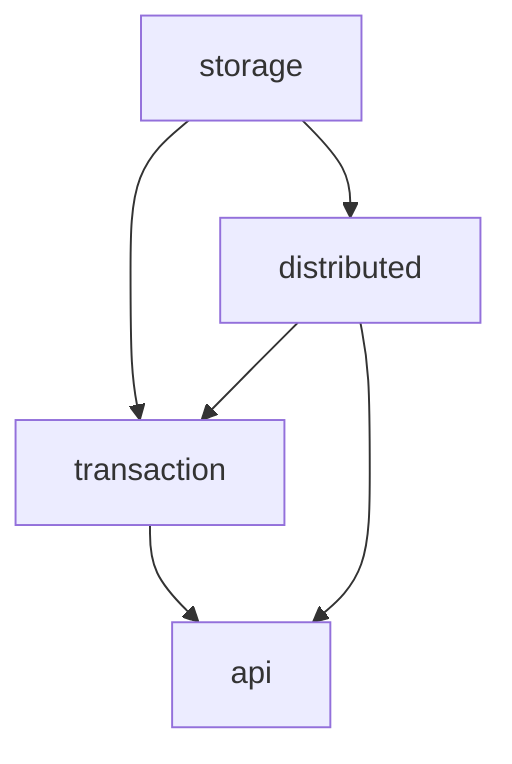

# Go语言循环依赖问题详解

## 目录
1. [什么是循环依赖](#什么是循环依赖)
2. [Go vs Java的包系统差异](#go-vs-java的包系统差异)
3. [Go中循环依赖的表现](#go中循环依赖的表现)
4. [为什么Go不允许循环依赖](#为什么go不允许循环依赖)
5. [常见的循环依赖场景](#常见的循环依赖场景)
6. [解决循环依赖的策略](#解决循环依赖的策略)
7. [JadeDB项目中的实际案例](#jadedb项目中的实际案例)
8. [最佳实践建议](#最佳实践建议)

## 什么是循环依赖

循环依赖（Circular Dependency）是指两个或多个模块/包之间相互依赖，形成一个闭环的依赖关系。

### 简单的循环依赖示例：
```
包A 依赖 包B
包B 依赖 包A
```

### 复杂的循环依赖示例：
```
包A 依赖 包B
包B 依赖 包C  
包C 依赖 包A
```

## Go vs Java的包系统差异

### Java的包系统特点

1. **基于类的依赖**：Java的依赖是基于类（Class）级别的
2. **运行时解析**：Java在运行时通过ClassLoader动态加载类
3. **允许循环依赖**：Java允许类之间的循环依赖，通过延迟初始化解决
4. **包只是命名空间**：Java的包主要用于组织和命名空间管理

```java
// Java示例 - 允许循环依赖
package com.example.a;
import com.example.b.ClassB;

public class ClassA {
    private ClassB b; // 可以引用B包中的类
    
    public void setB(ClassB b) {
        this.b = b;
    }
}

package com.example.b;
import com.example.a.ClassA;

public class ClassB {
    private ClassA a; // 可以引用A包中的类
    
    public void setA(ClassA a) {
        this.a = a;
    }
}
```

### Go的包系统特点

1. **基于包的依赖**：Go的依赖是基于包（Package）级别的
2. **编译时解析**：Go在编译时必须解析所有依赖关系
3. **严格禁止循环依赖**：Go编译器严格检查并禁止包级别的循环依赖
4. **包是编译单元**：Go的包是独立的编译单元

```go
// Go示例 - 不允许循环依赖
package a
import "myproject/b" // 包a依赖包b

type TypeA struct {
    B *b.TypeB
}

package b  
import "myproject/a" // 包b依赖包a - 编译错误！

type TypeB struct {
    A *a.TypeA // 这会导致循环依赖编译错误
}
```

## Go中循环依赖的表现

### 编译错误信息
当Go检测到循环依赖时，会产生类似以下的编译错误：

```bash
package myproject/a
    imports myproject/b
    imports myproject/a: import cycle not allowed
```

### 依赖图示例
```
myproject/transaction → myproject/distributed
myproject/distributed → myproject/transaction
```
这种情况下，Go编译器会报告循环依赖错误。

## 为什么Go不允许循环依赖

### 1. **编译时确定性**
Go需要在编译时确定所有依赖关系，循环依赖会导致编译器无法确定包的初始化顺序。

### 2. **包初始化顺序**
Go包有明确的初始化顺序：
- 先初始化被依赖的包
- 再初始化依赖其他包的包
- 循环依赖会导致初始化顺序无法确定

### 3. **简化依赖管理**
禁止循环依赖强制开发者设计更清晰的架构，避免复杂的依赖关系。

### 4. **编译性能**
避免循环依赖可以提高编译性能，减少编译器的复杂度。

## 常见的循环依赖场景

### 场景1：相互引用的数据结构
```go
// 错误示例
package user
import "myproject/order"

type User struct {
    Orders []*order.Order
}

package order
import "myproject/user"

type Order struct {
    User *user.User // 循环依赖！
}
```

### 场景2：服务层相互调用
```go
// 错误示例
package userservice
import "myproject/orderservice"

func (s *UserService) GetUserOrders() {
    orderservice.GetOrdersByUser()
}

package orderservice  
import "myproject/userservice"

func (s *OrderService) CreateOrder() {
    userservice.ValidateUser() // 循环依赖！
}
```

### 场景3：接口和实现分离不当
```go
// 错误示例
package storage
import "myproject/business"

type Storage interface {
    Save(business.Entity) error
}

package business
import "myproject/storage"

type Entity struct {
    storage storage.Storage // 循环依赖！
}
```

## 解决循环依赖的策略

### 策略1：提取公共包（Common Package）
将共享的类型和接口提取到独立的包中。

```go
// 解决方案：创建common包
package common

type User struct {
    ID   string
    Name string
}

type Order struct {
    ID     string
    UserID string
}

// user包
package user
import "myproject/common"

func GetUser(id string) *common.User {
    // 实现
}

// order包  
package order
import "myproject/common"

func GetOrder(id string) *common.Order {
    // 实现
}
```

### 策略2：依赖倒置（Dependency Inversion）
通过接口实现依赖倒置，让高层模块不依赖低层模块。

```go
// 解决方案：使用接口
package user

type OrderService interface {
    GetOrdersByUser(userID string) []Order
}

type UserService struct {
    orderSvc OrderService // 依赖接口而不是具体实现
}

package order

import "myproject/user"

type OrderServiceImpl struct{}

func (s *OrderServiceImpl) GetOrdersByUser(userID string) []user.Order {
    // 实现
}
```

### 策略3：事件驱动架构
使用事件系统解耦模块间的直接依赖。

```go
// 解决方案：事件驱动
package events

type Event interface {
    Type() string
}

type EventBus interface {
    Publish(event Event)
    Subscribe(eventType string, handler func(Event))
}

package user
import "myproject/events"

func (s *UserService) CreateUser(user User) {
    // 创建用户
    events.Publish(UserCreatedEvent{User: user})
}

package order
import "myproject/events"

func init() {
    events.Subscribe("UserCreated", handleUserCreated)
}
```

### 策略4：分层架构
建立清晰的分层架构，确保依赖关系单向流动。

```go
// 分层架构示例
myproject/
├── domain/          # 领域层（最底层，不依赖其他层）
│   ├── user.go
│   └── order.go
├── repository/      # 仓储层（依赖domain层）
│   ├── user_repo.go
│   └── order_repo.go  
├── service/         # 服务层（依赖repository和domain层）
│   ├── user_service.go
│   └── order_service.go
└── api/            # API层（依赖service层）
    ├── user_api.go
    └── order_api.go
```

### 策略5：使用内部包（Internal Package）
Go的internal包机制可以帮助组织代码结构。

```go
myproject/
├── internal/
│   ├── common/      # 内部公共包
│   ├── domain/      # 内部领域模型
│   └── repository/  # 内部仓储实现
├── user/           # 对外用户服务
└── order/          # 对外订单服务

## JadeDB项目中的实际案例

### 问题场景
在JadeDB项目重构过程中，我们遇到了典型的循环依赖问题：

```go
// 原始问题结构
transaction/
├── mvcc_manager.go          // 使用distributed包的类型
├── percolator.go           // 使用distributed包的Raft功能
└── coordinator.go          // 使用distributed包的共识机制

distributed/
├── raft.go                 // 使用transaction包的MVCC功能
├── percolator_coordinator.go // 使用transaction包的事务类型
└── consensus.go            // 使用transaction包的锁管理
```

这种结构导致了循环依赖：

```text
transaction → distributed → transaction
```

### 解决方案实施

#### 1. 类型定义重构
我们将共享的类型定义提取到专门的文件中：

```go
// transaction/percolator_types.go - 专门存放Percolator相关类型
type PercolatorDataRecord struct {
    Value     []byte    `json:"value"`
    StartTS   uint64    `json:"start_ts"`
    TxnID     string    `json:"txn_id"`
    CreatedAt time.Time `json:"created_at"`
}

type PercolatorLockRecord struct {
    TxnID      string                `json:"txn_id"`
    StartTS    uint64                `json:"start_ts"`
    PrimaryKey []byte                `json:"primary_key"`
    LockType   distributed.LockType  `json:"lock_type"`
    TTL        uint64                `json:"ttl"`
    CreatedAt  time.Time             `json:"created_at"`
}

// distributed/interfaces.go - 专门存放接口定义
type TransactionManager interface {
    Begin() (Transaction, error)
    Commit(txn Transaction) error
    Abort(txn Transaction) error
}

type ConsensusEngine interface {
    Propose(data []byte) error
    GetState() ConsensusState
}
```

#### 2. 依赖方向重新设计
重新设计依赖关系，确保单向依赖：

```go
// 新的依赖结构
storage/                    # 底层存储（无依赖）
├── btree.go
├── lsm.go
└── interfaces.go

distributed/                # 分布式层（依赖storage）
├── raft.go
├── consensus.go
├── interfaces.go
└── types.go

transaction/                # 事务层（依赖storage和distributed）
├── mvcc.go
├── percolator.go
├── coordinator.go
└── types.go
```

#### 3. 接口抽象应用
使用接口来解耦具体实现：

```go
// distributed/interfaces.go
type StorageEngine interface {
    Get(key []byte) ([]byte, error)
    Put(key, value []byte) error
    Delete(key []byte) error
}

type ConsensusEngine interface {
    Propose(data []byte) error
    AddNode(nodeID string) error
    RemoveNode(nodeID string) error
}

// transaction/mvcc_manager.go
type MVCCManager struct {
    storage distributed.StorageEngine    // 依赖接口
    consensus distributed.ConsensusEngine // 依赖接口
}
```

### 重构前后对比

#### 重构前（有循环依赖）

```text
编译错误：
package github.com/util6/JadeDB/transaction
    imports github.com/util6/JadeDB/distributed
    imports github.com/util6/JadeDB/transaction: import cycle not allowed
```

#### 重构后（无循环依赖）

```text
✅ 编译成功
✅ 清晰的分层架构
✅ 单向依赖关系
✅ 高内聚低耦合
```

## 最佳实践建议

### 1. 设计阶段预防

#### 绘制依赖图
在设计阶段就绘制包依赖图，确保依赖关系是有向无环图（DAG）：



#### 分层架构原则
遵循经典的分层架构原则：
- **表示层（Presentation Layer）**：API、Web界面
- **业务层（Business Layer）**：业务逻辑、事务管理
- **数据访问层（Data Access Layer）**：数据库访问、存储
- **基础设施层（Infrastructure Layer）**：日志、配置、工具

### 2. 代码组织策略

#### 按功能模块组织
```go
jadedb/
├── cmd/                    # 命令行工具
├── internal/               # 内部包
│   ├── storage/           # 存储引擎
│   ├── consensus/         # 共识算法
│   ├── transaction/       # 事务管理
│   └── common/            # 公共类型和工具
├── pkg/                   # 对外API
│   ├── client/           # 客户端SDK
│   └── server/           # 服务器API
└── api/                   # HTTP/gRPC接口
```

#### 使用internal包
Go的`internal`包机制可以限制包的可见性：
```go
myproject/
├── internal/
│   ├── core/              # 核心业务逻辑（其他包不可访问）
│   └── utils/             # 内部工具函数
├── pkg/                   # 公开API
└── cmd/                   # 命令行工具
```

### 3. 接口设计原则

#### 接口隔离原则（ISP）
定义小而专一的接口：

```go
// 好的设计：小接口
type Reader interface {
    Read([]byte) (int, error)
}

type Writer interface {
    Write([]byte) (int, error)
}

// 避免：大而全的接口
type FileOperator interface {
    Read([]byte) (int, error)
    Write([]byte) (int, error)
    Seek(int64, int) (int64, error)
    Close() error
    Stat() (FileInfo, error)
    // ... 更多方法
}
```

#### 依赖倒置原则（DIP）
高层模块不应该依赖低层模块，两者都应该依赖抽象：

```go
// 高层模块
package service

type UserService struct {
    repo UserRepository // 依赖抽象接口
}

// 抽象接口
type UserRepository interface {
    Save(user User) error
    FindByID(id string) (*User, error)
}

// 低层模块实现接口
package repository

type MySQLUserRepository struct {
    db *sql.DB
}

func (r *MySQLUserRepository) Save(user service.User) error {
    // MySQL实现
}

func (r *MySQLUserRepository) FindByID(id string) (*service.User, error) {
    // MySQL实现
}
```

### 4. 重构现有循环依赖

#### 步骤1：识别循环依赖
使用工具检测循环依赖：
```bash
# 使用go mod graph查看依赖关系
go mod graph

# 使用第三方工具
go get github.com/kisielk/godepgraph
godepgraph -s github.com/yourproject | dot -Tpng -o deps.png
```

#### 步骤2：分析依赖原因
- 哪些类型/函数导致了循环依赖？
- 是否可以通过接口抽象解决？
- 是否需要重新组织包结构？

#### 步骤3：选择重构策略
根据具体情况选择合适的重构策略：
- 提取公共包
- 依赖倒置
- 事件驱动
- 重新分层

#### 步骤4：渐进式重构
不要一次性大规模重构，采用渐进式方法：
1. 先解决最严重的循环依赖
2. 逐步优化包结构
3. 持续重构和改进

### 5. 工具和检查

#### 编译时检查
Go编译器会自动检测循环依赖，但可以使用额外工具：

```bash
# 检查包依赖
go list -deps ./...

# 检查循环依赖
go build ./...
```

#### 持续集成检查
在CI/CD流水线中添加循环依赖检查：

```yaml
# .github/workflows/ci.yml
- name: Check for circular dependencies
  run: |
    go mod graph | awk '{print $1}' | sort -u > deps.txt
    if grep -q "cycle" deps.txt; then
      echo "Circular dependency detected!"
      exit 1
    fi
```

### 6. 常见陷阱和避免方法

#### 陷阱1：过度抽象
不要为了避免循环依赖而过度抽象，保持代码的可读性和简洁性。

#### 陷阱2：接口爆炸
避免定义过多的小接口，找到合适的抽象粒度。

#### 陷阱3：隐式依赖
注意隐式依赖，如通过全局变量、init函数等创建的依赖关系。

## 总结

Go语言的循环依赖限制虽然在初期可能带来一些不便，但它强制开发者设计更清晰、更模块化的架构。通过合理的包设计、接口抽象和分层架构，不仅可以避免循环依赖，还能提高代码的可维护性和可测试性。

在JadeDB项目的重构过程中，我们通过类型提取、接口抽象和依赖重组成功解决了循环依赖问题，使项目结构更加清晰和健壮。

记住：**循环依赖的限制不是Go的缺陷，而是Go帮助我们写出更好代码的特性。**
```
